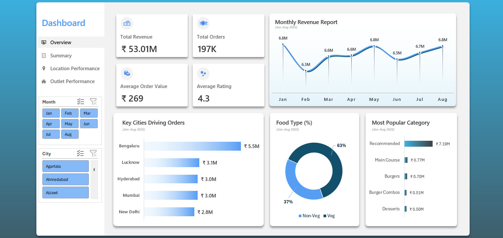

# 📊 Food Delivery Sales & Performance Dashboard

## 📷 Overview Dashboard

## 🔎 Project Overview
This project presents an **interactive Excel dashboard analyzing food delivery sales performance** across multiple business dimensions such as revenue trends, city contribution, food category performance, and location-level demand.

The dashboard transforms raw order data into **actionable business insights** through dynamic visualizations and slicer-driven filtering.

The analysis covers **January–August 2025** and highlights key drivers of revenue, demand distribution, and category performance.

---

# 🎯 Business Objectives

The dashboard helps answer key business questions:

- How is **monthly revenue trending over time?**
- Which **cities generate the most orders and revenue?**
- What **food categories drive the majority of sales?**
- Which **locations have the highest and lowest demand?**
- Which **outlets generate the highest and lowest revenue?**
- Which outlets have the **highest and lowest ratings?**

---

# 📈 Dashboard Pages

## 1️⃣ Overview Dashboard

Provides a high-level snapshot of overall business performance.

### Key KPIs
- **Total Revenue:** ₹53.01M  
- **Total Orders:** 197K  
- **Average Order Value:** ₹269  
- **Average Rating:** 4.3  

### Visualizations
- Monthly Revenue Trend
- Key Cities Driving Orders
- Veg vs Non-Veg Sales Distribution
- Most Popular Food Categories

### Purpose
Helps stakeholders quickly understand the **overall performance and key revenue drivers**.

---

## 2️⃣ Summary Dashboard

This page focuses on **revenue performance and executive insights**.

### Visualizations
- Monthly Revenue Trend (Jan–Aug 2025)
- Key Business Takeaways
- Sales Trend Summary
- Executive Interpretation

### Key Insights
- Revenue remained **relatively stable with minor fluctuations**
- **January and May recorded the highest revenue**
- **February showed a temporary dip**
- Performance improved again towards **July and August**

### Purpose
Provides **business-level interpretation of sales performance** to support strategic decision-making.

---

## 3️⃣ Category Performance Dashboard

Analyzes **revenue contribution by food categories**.

### Visualizations
- Most Popular Category (Bar Chart)
- Category Performance Summary
- Key Business Takeaways
- Executive Interpretation

### Key Insights
- **Recommended category dominates total sales**
- Main Course and Burgers contribute moderate revenue
- Desserts and Burger Combos contribute the least

### Purpose
Helps identify **top-performing food categories and opportunities for product expansion**.

---

## 4️⃣ Location Performance Dashboard

Analyzes **regional demand patterns based on order count and revenue**.

### Visualizations
- High Demand Regions by Order Count
- Low Demand Regions by Order Count
- Top 5 Cities by Order Value
- Bottom 5 Cities by Order Value

### Key Insights
- Certain locations generate **significantly higher order volumes**
- Several regions contribute **very low demand**
- Revenue distribution varies significantly across cities

### Purpose
Helps businesses **identify strong markets and underperforming regions** for targeted strategies.

---

## 5️⃣ Outlet Performance Dashboard

Analyzes **outlet-level revenue and rating performance**.

### Visualizations
- Highest Revenue Generating Outlets
- Lowest Revenue Generating Outlets
- Highest Rated Outlets
- Lowest Rated Outlets

### Purpose
Helps identify:
- **Top-performing outlets**
- **Underperforming outlets**
- **Customer satisfaction levels**

This information can support **operational improvements and performance monitoring**.

# 🛠 Tools Used

- Microsoft Excel
- Pivot Tables
- Pivot Charts
- Slicers
- Conditional Formatting
- Dashboard UI Design
- Data Aggregation

---

# 📊 Skills Demonstrated

- Data Analysis  
- Dashboard Design  
- Data Visualization  
- KPI Monitoring  
- Business Insight Generation  
- Performance Analysis  

---

# 💡 Business Value

This dashboard helps stakeholders:

- Monitor **overall sales performance**
- Identify **top revenue drivers**
- Detect **low-performing regions**
- Understand **customer preference patterns**
- Support **data-driven business decisions**

---
